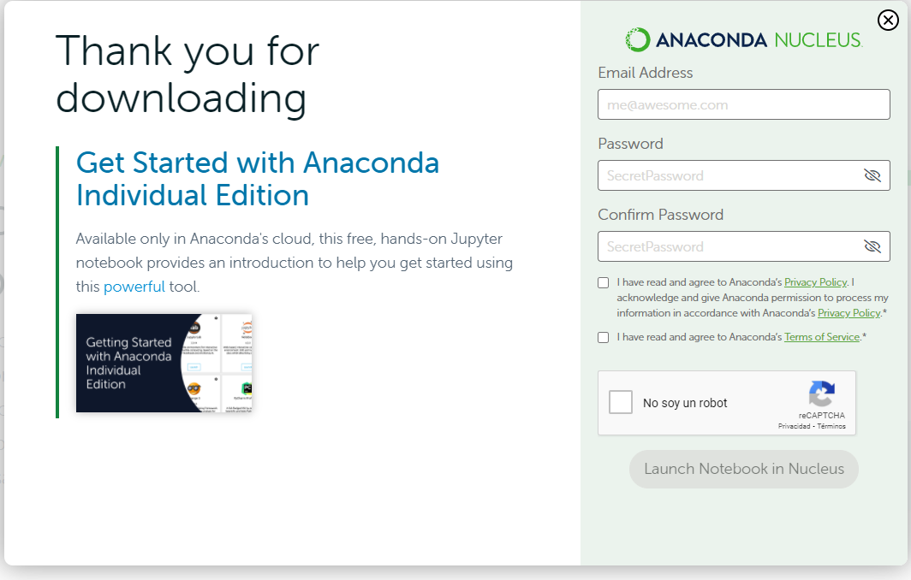
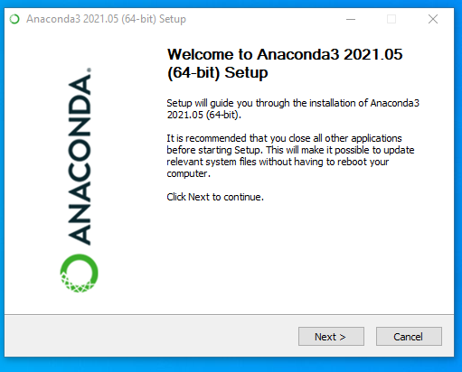
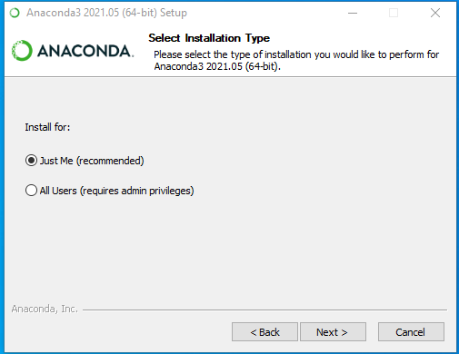
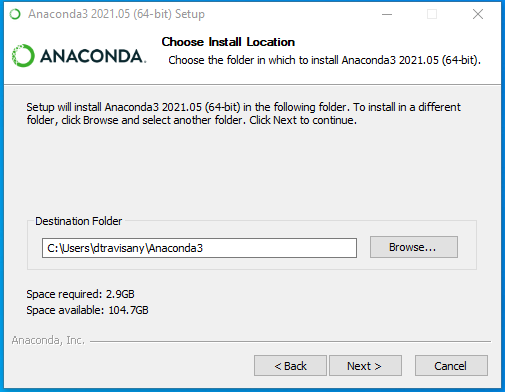
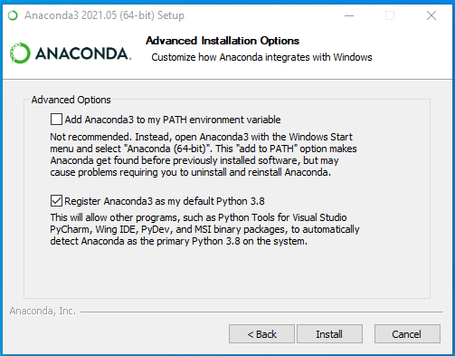
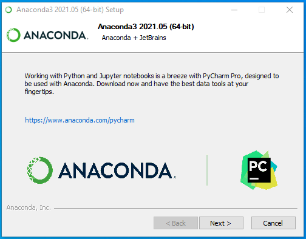
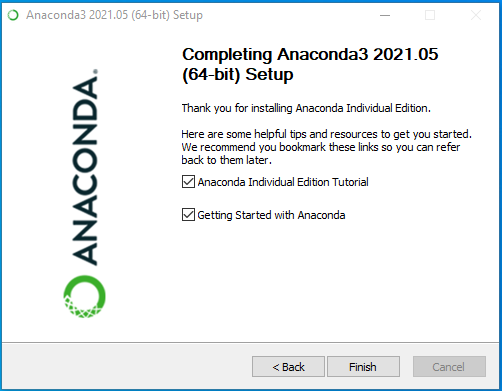
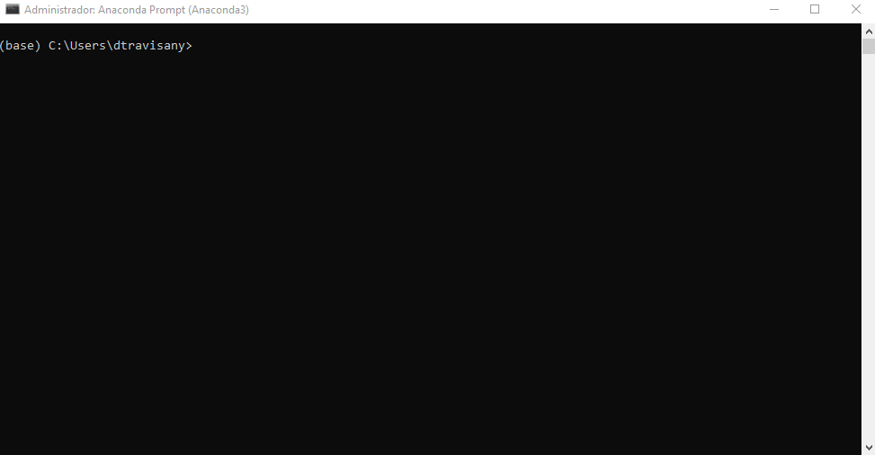
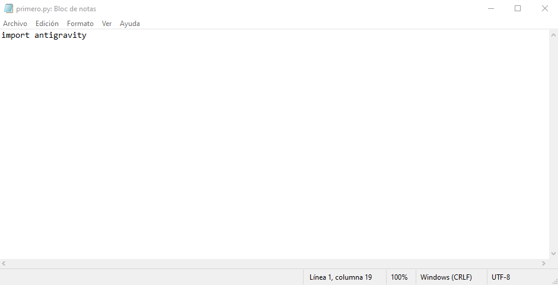

# Tutorial para instalar Anaconda :snake: en Windows

Durante el curso utilizaremos [Anaconda](https://www.anaconda.com/products/individual-d):

La edición Individual de Anaconda es una distribución de código abierto que permite realizar ciencia de datos y aprendizaje de máquina/automático en Python o R en computadores personales. 
Esta distribución tiene más de 25 millones de usuarios en todo el mundo.

Al hacer click en [Anaconda](https://www.anaconda.com/products/individual-d)

Veremos la siguiente página:

Dependiendo de nuestro sistema operativo seleccionaremos el icono correspondiente y descargaremos la última version haciendo click en __Download__. También podemos navegar hasta el final de la página y seleccionar una versión particular o ir a versiones antiguas.

Al comenzar la descarga .
 Se abrirá una ventana emergente con un registro para Anaconda Nucleus, el cual es opcional.
 :warning: __No es necesario registrarse en Anaconda Nucleus__.

Al hacer ejecutar el instalador, se nos abrirá un clásico [wizard installer](https://www.installaware.com/suite-installer-wizard.htm):

Damos click en Next y podemos leer la licencia y aceptar o declinar. 
Si declinamos no podremos continuar con la instalación.

Luego se abrirá una ventana con el tipo de instalación con privilegios de admin o solo para el usuario activo.
La recomendación es que sea solo para mi (Just Me), debido a que lo recomendable es que cada usuario mantenga su propio Anaconda Python :snake:.

Luego debemos seleccionar la ruta (PATH) donde queremos que se instale nuestro Anaconda.

La siguiente ventana nos dará acceso a las Opciones Avanzadas, 
donde se nos pregunta: 
1. Si queremos agregar python al PATH del sistema (override del python del sistema) o creamos un python particular para  nosotros.
2. Registrar Anaconda como el PATH por defecto.

#### Es Recomendable quedarns con el por defecto ("Register Anaconda3 as my default Python 3.8...")

Luego nos saldrá la opción de ir a descargar PyCharm que es un IDE. Es una muy buena IDE y el que esté interesado puede descargarla. Sin embargo, 
en este curso no utilizaremos PyCharm por lo que no es necesaria su descarga.

Hacemos click en siguiente y esperamos a que se instale la suite, si todo anda bien:

Felicitaciones :fireworks: , has instalado Anaconda con éxito.

Ahora en la barra de búsqueda 
Escribimos:

    Anaconda Navigator

Y veremos la suite de herramientas que han sido instaladas en nuestro computador.

Desde acá podemos acceder a CMD.exe Prompt

o desde la barra de búsqueda 

Escribimos:

    Anaconda prompt

Esto nos abrirá la terminal con el python de Anaconda cargado:

Ahora abriremos un block de notas o una herramienta recomendable para editar scripts en varios lenguajes como lo es 
[Notepad++](https://notepad-plus-plus.org/).

Y escribimos lo siguiente:

    import antigravity

 

Ahora guardamos nuestro documento en una carpeta de fácil acceso como

    C:\ACI777\scripts\primero.py

Luego ejecutamos nuestro comando en el prompt de anaconda con la siguiente instrucción:

    python C:\ACI777\scripts\primero.py

y me cuentan lo que pasa :trollface:.

Si pudieron ver la página, entonces tienen funcionando la suite anaconda.

Para los más clásicos, pueden escribir el siguiente comando en un nuevo archivo de texto:

    print("HOLA MUNDO!")

guardan su script y ejecutan en anaconda prompt.

