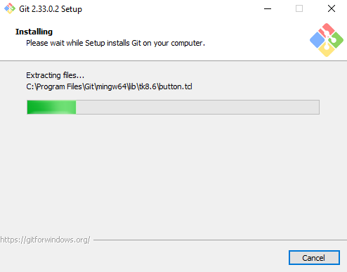

# git

## ¿Qué es git?

Git es un sistema de [control de versiones](https://es.wikipedia.org/wiki/Control_de_versiones) 
pensado para ser rápido y eficiente. Ha sido diseñado para manejar proyectos pequeños o muy grandes.

Git es fácil de aprender y mantiene un buen performance.

Un sistema de control de versiones nos permite guardar distintas versiones del proyecto y tener un historial de modificaciones.
Algunas utilidades de git son:

 1. Revisar versiones anteriores.
 2. Volver a versiones anteriores.
 3. Ramificación de código para distintos desarrolladores.
 4. Es Open Source.
 5. [Otras](https://git-scm.com/about)

En este tutorial partiremos con la instalación de git.

## Instalación de git

### Para Linux :penguin: / OsX :apple: :
Podemos descargarlo desde [https://git-scm.com]

o podemos realizar la instalación con la herramienta [apt](https://wiki.debian.org/es/Apt) en Debian/Ubuntu
si contamos con los privilegios de [sudo](https://wiki.debian.org/es/sudo)

Abra una terminal y ejecute el siguiente comando:

	sudo apt-get install git

En red-hat based distro podemos realizar la instalación con [yum](https://access.redhat.com/es/solutions/238003) siendo sudo.

	sudo yum install git

### Instalación en Windows 

No hay una versión oficial de git para windows, sin embargo existe una herramienta llamada [git for windows](https://gitforwindows.org/)
que podemos utilizar para ejecutar git en windows.

Git for windows provee de una emulación de [Bash](https://es.wikipedia.org/wiki/Bash) para ejecutar 
los comandos de git en sistema operativo Windows.

Otra cosa que podemos agregar, es que git for windows, posee una interfaz gráfica de usuario.

Podemos descargar git for windows desde el siguiente repositorio oficial de [git-for-windows](https://github.com/git-for-windows/git/releases/)

Entonces, procederemos a descargar y ver paso a paso la configuración de git for windows.

1. Entramos a https://gitforwindows.org/ y descargamos la versión en el link download:

2. Una vez descargado hacemos click en el .exe y se nos abrirá el tipico wizard de instalación:

3. Aceptamos la licencia [GNU General Public License Version 2](https://www.gnu.org/licenses/old-licenses/gpl-2.0.html):

4. Seleccionamos el path donde queremos que sea instalado git for windows, como podemos ver en la imagen en esta versión deben existir por lo menos 263 MB disponibles de espacio en disco para instalar el software:

5. Seleccionamos los componentes que queremos instalar, en mi caso yo agregue un acceso directo en el escritorio: 

6. En esta ventana, seleccionamos el nombre del menú de inicio donde se agregaran los accesos directos:

7. Ahora seleccionamos el editor de texto con el que vamos a trabajar en git.
#### :warning: Advertencia: en mi caso estoy acostumbrado a utilizar [Vim](https://www.vim.org/).
Vim es extremadamente útil sobretodo en entornos sin interfaz gráfica, pero resulta complejo adaptarse a utilizarlo y puede ser "tricky" dominarlo. 
:nerd_face: Como nota geek: El libro [Learning the Vi and Vim Editors](https://www.oreilly.com/library/view/learning-the-vi/9780596529833/) de O'REILLY dice: _"No hay nada por lo que los usuarios de Unix y Linux sean más fanáticos que su editor de texto. Los editores son objeto de adoración y culto, o de desprecio y burla..."_  

 

¿qué es github?

Puedes acceder a una hoja de [referencia](https://training.github.com/downloads/es_ES/github-git-cheat-sheet.pdf), tambien llamadas [cheat sheets](https://en.wikipedia.org/wiki/Cheat_sheet).

