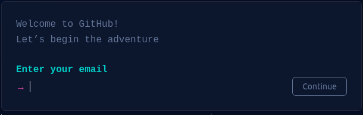
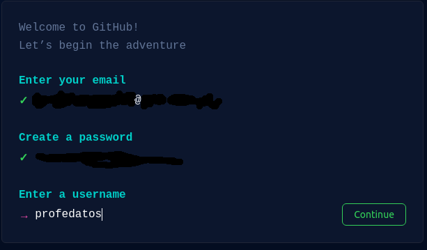
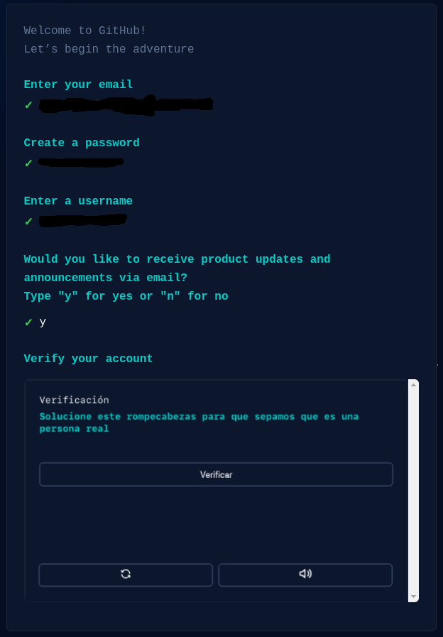
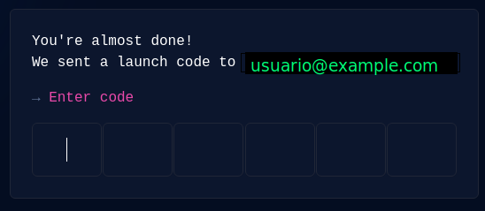
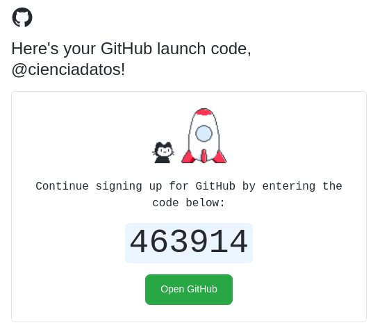
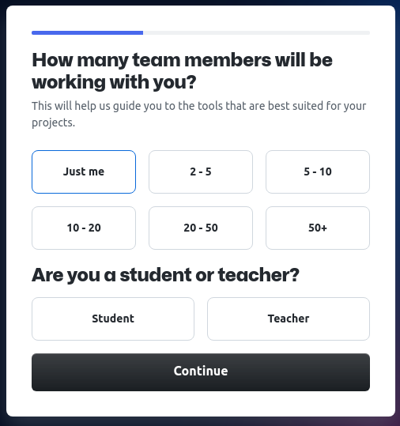
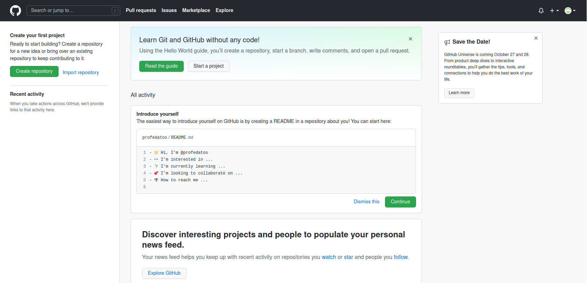

# ¿Qué es github?

GitHub se autodefine como  "_El hogar de la comunidad de desarrolladores más grande del mundo y de sus proyectos._"
Este tipo de sitios también se conoce como [forja](https://es.wikipedia.org/wiki/Forja_(software)), es decir una plataforma de desarrollo colaborativo de software.
Es utilizado por programadores para crear código fuente de programas computacionales.

¿Por qué git en github?

Porque utiliza git como sistema de control de versiones para los repositorios de código.

Algunas caracteristicas:
1. Herramienta de trabajo colaborativo para desarrolladores de software.
2. Cada proyecto tiene su repositorio, página web y wiki.
3. Funcionalidades de red social (el hub en github), seguir desarrolladores o tener seguidores.
4. [Otras](https://github.com/features)

Entonces ahora crearemos una cuenta de github  

Hacemos click en `Sign Up`:  

  

 y nos aparecerá el siguiente dialogo:  

  

Rellenamos los campos correspondientes y nos pedirá una verificación de "humanidad":  

Luego tendremos algunas opciones:  

Y nos pedirá confirmar nuestro perfil con un código enviado al correo que tendremos que poner en la siguiente casilla:  

Ejemplo de e-mail de código númerico:  

Luego nos dará la opción de miembros donde pondremos Just Me:  

Finalmente seleccionaremos algunas opciones:

Y ahora podremos acceder a nuestro github personal:

Con esto completamos el tutorial de creación de cuenta en github, ahora iremos al práctico evaluado

Puedes acceder a una hoja de [referencia](https://training.github.com/downloads/es_ES/github-git-cheat-sheet.pdf), tambien llamadas [cheat sheets](https://en.wikipedia.org/wiki/Cheat_sheet).
